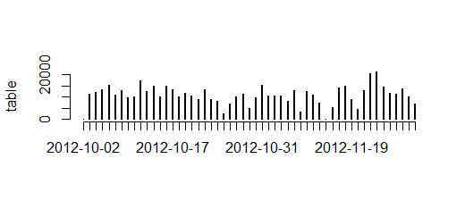
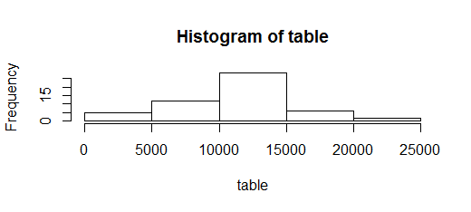
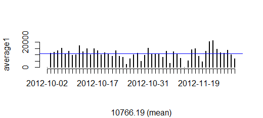
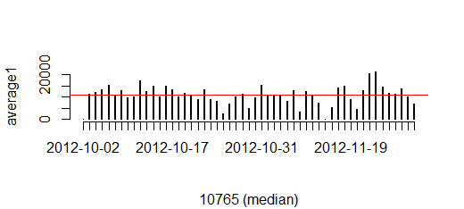
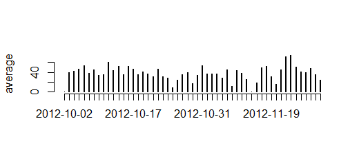
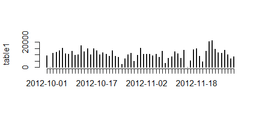
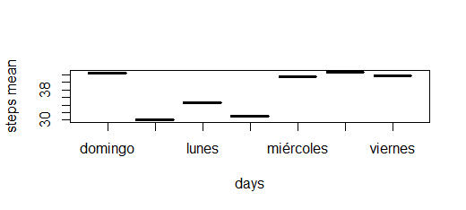
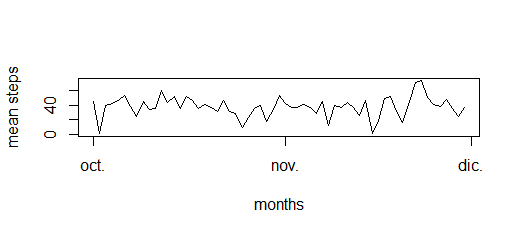

str(activity)
summary(activity)

1.Code for reading in the dataset and/or processing the data
-Load the data 
-Process/transform the data (if necessary) into a format suitable for your analysis
```{r first,echo=TRUE}
getwd()
setwd("C:/Users/User/Documents/Reproducible research/First Homework")
active<-read.table("C:/Users/User/Documents/Reproducible research/First Homework/activity.csv",sep=",",header=TRUE)
```

2.Histogram of the total number of steps taken each day
-Calculate the total number of steps taken per day
```{r fig.width=7,fig.height=5,echo=TRUE}
str(active)
library(ggplot2)
date=as.character(active$date)
summary(active)
aa<-(tapply(active$steps,date,sum))
##Removing na
ab<- aa[!is.na(aa)]
table=as.table(ab)
View(table)
plot(table) 
hist(table) 
```



3.Mean and median number of steps taken each day
-Calculate and report the mean and median of the total number of steps taken per day
```{r fig.width=7,fig.height=5,echo=TRUE}
##mean
a<-tapply(active$steps,active$date,mean)
a1<- aa[!is.na(aa)]
average1=as.table(a1)
average2=as.data.frame(average1)
plot(average1,sub="10766.19 (mean)")
abline(h=10766.19,col="blue")
##median
plot(average1,sub="10765 (median)")
abline(h=10765,col="red")
```
.mean


.median


4.Time series plot of the average number of steps taken

```{r fig.width=7,fig.height=5,echo=TRUE}
ac<-(tapply(active$steps,date,mean))
ad<- ac[!is.na(ac)]
average=as.table(ad)
View(average)
plot(average)
```


5.The 5-minute interval that, on average, contains the maximum number of steps

```{r fig.width=7,fig.height=5,echo=TRUE}
interval=as.character(active$interval)

##Here I have the data from the time interval with the maximum number of steps
ae<-active[,1]
af<-active[,3]
max(ae,na.rm=TRUE)
subset(af,ae=="806")

##Here I put the mean of the time interval
ag<-cbind(ae,af)
ah<-as.character(ae)
ai<-(tapply(af,ah,mean))
aj<-as.table(ai)

dataframe1<-as.data.frame(aj)
colnames(dataframe1)<-c("steps1","interval1")
steps2<-as.numeric(dataframe1$steps1)
interval1<-as.numeric(dataframe1$interval1)
max(steps2,rm.na=TRUE)
subset(dataframe1$interval1,steps2=="617")
```
**The 5-minute interval that, on average, contains the maximum number of steps is 1285**


6.Code to describe and show a strategy for imputing missing data

```{r fig.width=7,fig.height=5,echo=TRUE}
##I am going to impute the na with some random number from the same column
randomly <- function (z){
        quantifying.na <- is.na(z)
        n.missing <- sum(quantifying.na)
        a.obs <- z[!quantifying.na]
        imputed <- z
        imputed[quantifying.na] <- sample (a.obs, n.missing, replace=TRUE)
        return (imputed)
}
```

7.Histogram of the total number of steps taken each day after missing values are imputed
```{r fig.width=7,fig.height=5,echo=TRUE}
##Looking for na´s in the date and steps variables
summary(is.na(active$date))
summary(is.na(active$steps))
##There is na´s only on steps,so
steps.random.na<- randomly (active$steps)
##Total number of steps, just like the second exercise

library(ggplot2)
date=as.character(active$date)
ah<-(tapply(steps.random.na,date,sum))
table1=as.table(ah)
plot(table1)
hist(table1)
```


8.Panel plot comparing the average number of steps taken per 5-minute interval across weekdays and weekends
```{r fig.width=7,fig.height=5,echo=TRUE}
##Without taken the na´s
active$date<-as.POSIXlt(active$date)
day<-weekdays(active$date)

ak<-(tapply(active$steps,day,mean))
añ<-as.table(ak)
al<-as.data.frame(añ)
colnames(al)<-c("days1","steps")

##Taken out the na´s and replacing it by random numbers
steps.random.na2<- randomly (active$steps)
ap<-(tapply(steps.random.na2,date,mean))
table2=as.table(ap)
plot(table2)
aq<-as.data.frame(table2)
colnames(aq)<-c("date3","steps3")
plot(aq,type="l",ylab="mean steps",xlab="months")

aq$date3<-as.POSIXlt(aq$date3)
day3<-weekdays(aq$date3)

ar<-(tapply(aq$steps3,day3,mean))
table3<-as.table(ar)
as<-as.data.frame(table3)        
colnames(as)<-c("days4","steps4")
plot(as,ylab="steps mean",xlab="days")
```




